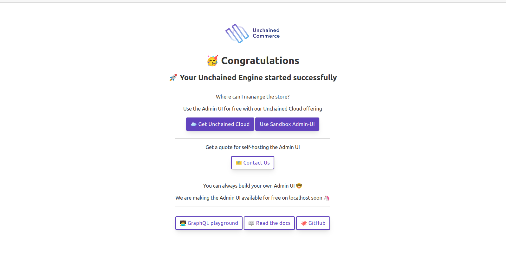

> In this section, we will walk you through the steps required to start up an Unchained Engine API server locally.


This tutorial helps you:

- Configure and run unchained engine.
- Access the engine through the [Admin UI sandbox](https://sandbox.unchained.shop/log-in)
- Open the graphQL playground of your local Unchained Engine

.

## Step 1: Installation

1. First create a new folder for your project to be installed.

```bash
mkdir my-unchained-engine
cd my-unchained-engine
```

2. Use the Unchained initialization script to download the code.

```bash
npm init @unchainedshop
```

3. A message prompts you to select the installation template. Choose **Unchained engine** by using the `down key` and press `enter`

```bash
? What type of template do you want ›
Full stack e-commerce
Storefront
Unchained engine <--
```

4. Next two steps are to select the directory, as we already created a new empty directory you can simply press `enter`, and whether you want to initialize git which is up to you.

```bash
? Directory name relative to current directory
 (press Enter to use current directory) ›
? Do you want Initialize git? no / yes
```

5. Make sure your node version is 16+ and install the npm packages

```bash
npm install
```

The installation script downloads, installs and initialises all files and packages required to build and run unchained engine.

## Step 2: Start the Unchained Engine

```bash
npm run dev
```

Open [localhost:4010](http://localhost:4010) to check if your unchained engine is running correctly. You should see the following **Landing page** in your browser 



## Open Admin UI sandbox
On the initial landing page there are various options you can choose including [Use sandbox Admin UI](https://sandbox.unchained.shop/log-in). Click on that button to mange you local engine instance using the admin ui sandbox, it will redirect you to a login page, use the below credentials to login into the engine and make sure to change the credentials as soon as possible

**Username**: _admin@unchained.local_<br />
**Password**: _password_


You can also click on [Graphql playground](http://localhost:4010/graphql) to opens the GraphQL playground for you to easily execute queries and mutations.

## Step 3: Add Products

If you want to set up the store and add products and categories using the admin UI follow the instruction of the [Getting-Started](../getting-started/engine-controlpanel) guide using your local admin UI instance under [localhost:4010](http://localhost:4010).

Follow the examples to learn about how to add products, initiate a check-out and use plugins with GraphQL.

## Next steps

An easy way to test the Unchained Engine is to setup the test storefront web app created with [React.js](https://reactjs.org/) and [Next.js](https://nextjs.org/) locally and connect our local Unchained Engine GraphQL API to it which is covered in the next chapter.
